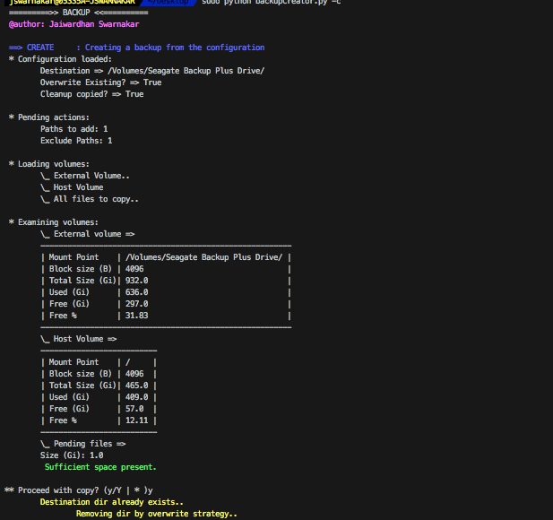

# Backup

Being a programmer, I hate to create backups in a drag-and-drop way. Frequently switching Macs and between Fedora and Xubuntu made creating backups and recovery a pain, especially when i wanted only very specific files/directories to be backed up. `Backup` is a programmatic way to create and recover backups from location A to location B and back. Locations can be host volumes or external volumes and can be completely controlled by the config `backupOptions.json` file.

## Usage
Run help:
```
$: python backupCreator.py --help
```

### Creating a backup
Run as `sudo` for most cases, and pass `--create` or `-c`:
```bash
$: sudo python backupCreator.py --create
# or
$: sudo python backupCreator.py -c
```

### Recovering from the same backup device
Run as `sudo` for most cases, and pass `--recover` or `-r`:
```bash
$: sudo python backupCreator.py --recover
# or
$: sudo python backupCreator.py -r
```

## Configuration options
- `add`: (List) A list of all dirs and files that need to be backed up
- `ignore`: (List) A list of all dirs and files that need to be ignored for backup.
- `storage`: The backup storage volume (eg. and external HDD)
    - `destination`: The path where this volume is mounted
    - `dir`: A directory on the recovery volume inside which you want the backup to be stored
    - `overwrite_existing`: Set this to `true` if you want any existing backups on the backup volume to be wiped out and overwritten
    - `cleanup_copied`: Set this to `true` if you want the files to be removed from your host once the backup copy is complete
- `recover`: Recover options config
    - `destination`: Base volume where you want the backup to be recovered. Generally your host.
    - `owner`: When restored, which user do you want to be the owner (username)? _(If you made the backup as root, you might want to get them back to your username upon recovery)_
    - `group`: When restored, which group do you want to be the owner (group name)? _(If you made the backup as root, you might want to get them back to the old group upon recovery)_

## Screenshots
Here is some sneak peek :)

### Backup Creation

_contd._


### Backup Recovery

_contd._


## Minimum compatibility
- Python 2.6+

:shipit:
